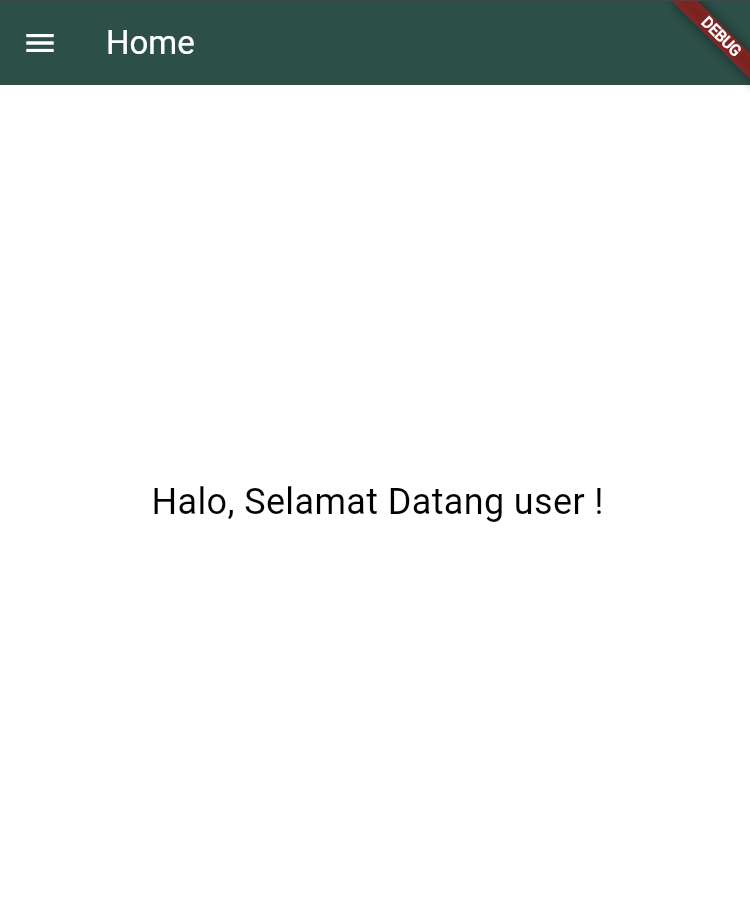
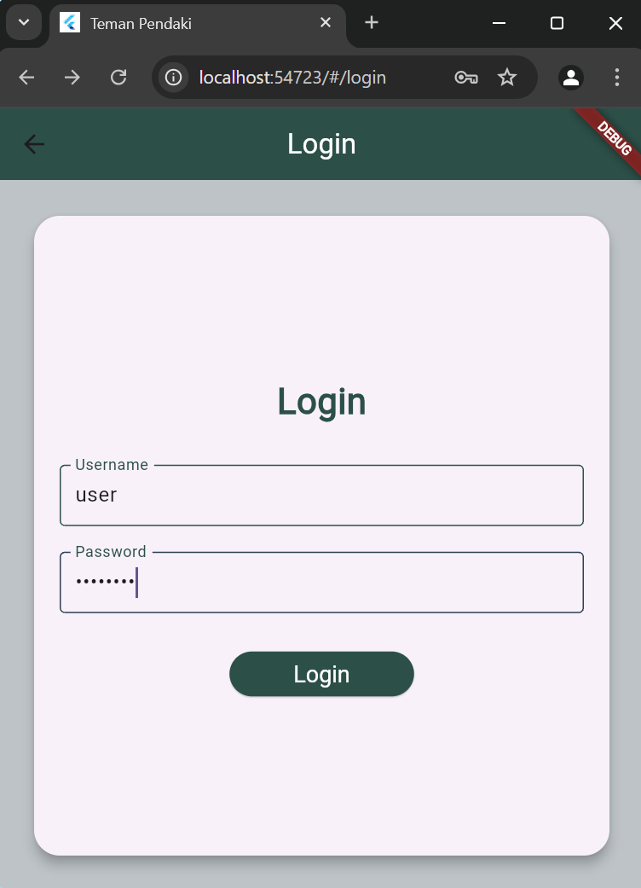
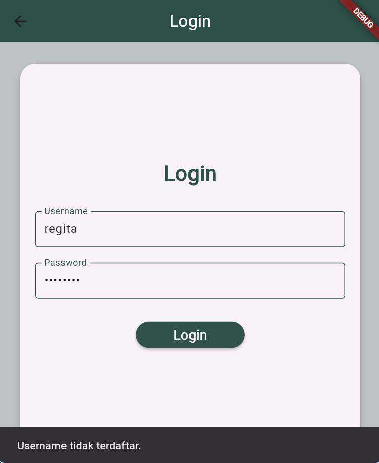
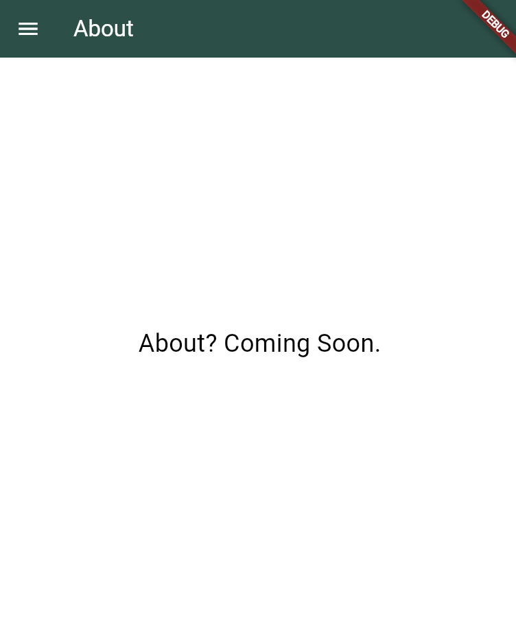
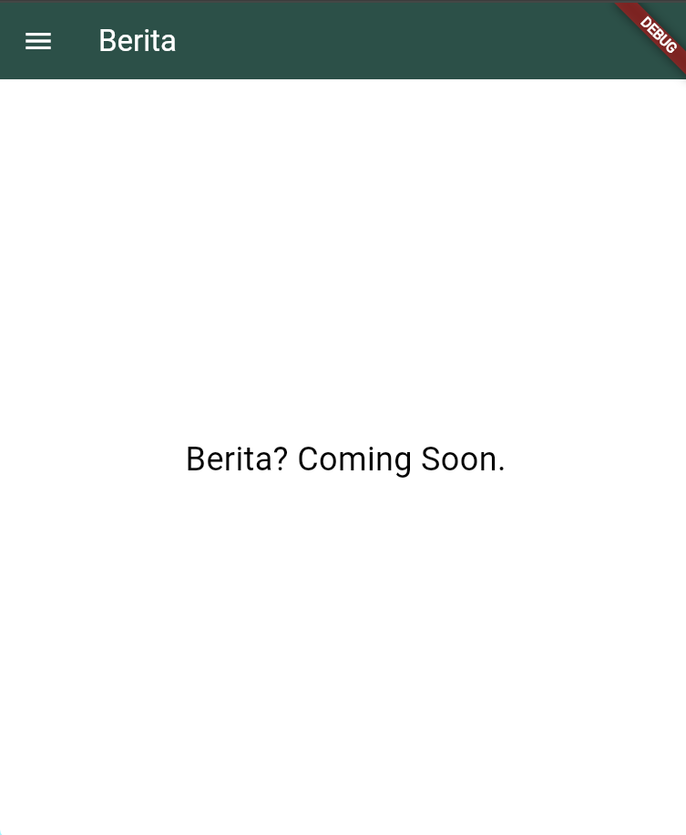
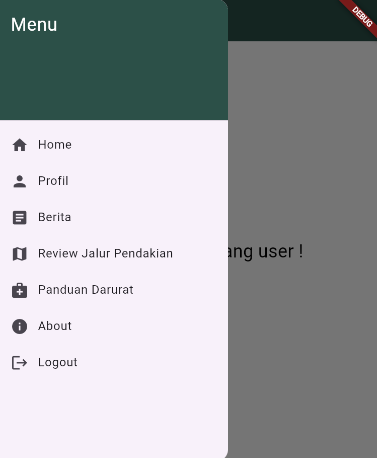

# Tugas 3

Nama: Regita Maulia Gani Nur Rahman

NIM: H1D022021

Shift: C

## Penjelasan

import flutter/material.dart untuk elemen UI dan shared_preferences/shared_preferences.dart untuk menyimpan data lokal

Class LoginPage menggunakan StatefulWidget agar dapat mengelola inputan user (username dan password)

_usernameController dan _passwordController adalah instance dari TextEditingController() untuk mengelola inputan text dari user (username dan password)

Future<void> _loadUsername() async => memuat nusername dari penyimpanan lokal menggunakan SharedPreferences.

_username = prefs.getString('username') ?? 'Teman Pendaki';
mengambil nilai string 'username' dari SharedPreferences

(Tampilan Home jika sudah login) 

jika belum login, maka akan menampilkan nilai default yaitu 'Teman Pendaki'

obscureText meyembunyikan teks yang dimasukkan di kolom password agar lebih aman

_login method memeriksa inputan user (username dan password) valid ('user' dan 'password'), jika login berhasil, username disimpan di SharedPreferences, lalu user diarahkan ke halaman utama (/home) menggunakan Navigator.pushReplacementNamed
jika salah, maka akan ditampilkan SnackBar

Class HomePage menggunakan StatefulWidget yang menampilkan halaman utama setelah user login

_username variabel untuk menyimpan nama pengguna yang dimuat dari SharedPreferences

void initState() method ini dipanggil saat objek State pertama kali dibuat, memanggil method _loadUsername() untuk mengambil username dari SharedPreferences

build method ini mengatur halaman utama menggunakan Scaffold

AppBar menampilkan judul seperti "About" di bagian atas layar

Body menampilkan teks "Berita? Coming Soon."

Class SideMenu extends StatelessWidget widget yang menampilkan menu samping untuk navigasi

ListTile untuk membuat item menu yang dapat diklik untuk navigasi ke halaman lain

fungsi onTap untuk mengarahkan user ke halaman yang sesuai saat item menu diklik

Routing =
initialRoute: '/login',
      routes: {...}

shared_preferences: ^2.0.17
tambahkan dependencies tersebut untuk shared preferences atau local storage (agar bisa menyimpan data secara lokal)
